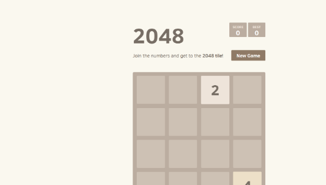
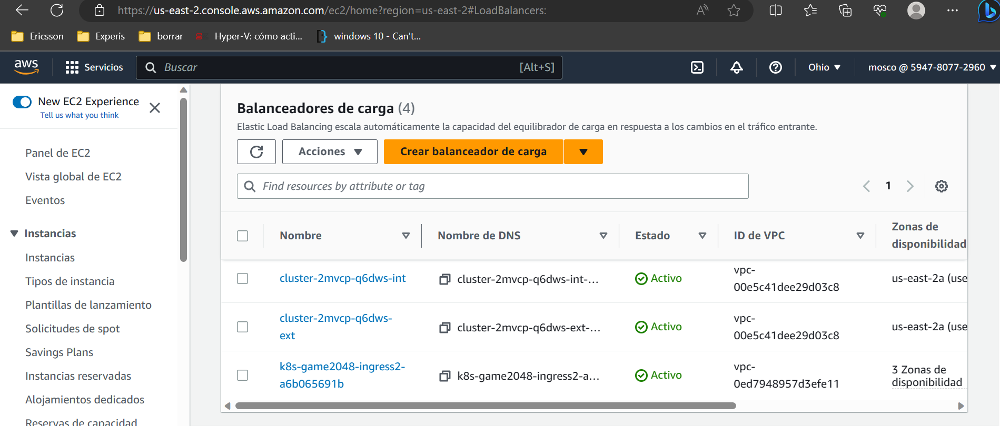

# EXPONER POD

1) AWS LOAD BALANCER CONTROLLER:
Con un OIDC (autenticador), roles, iam y policies vamos a crear un ALB de aws con Target Groups para poder ingresar trafico hacia nuestros pods.

2) Instalar EKSCTL:
https://github.com/eksctl-io/eksctl/blob/main/README.md#installation
3) Instalar ek ALB Controller:
https://github.com/eksctl-io/eksctl/blob/main/README.md#installation

``` yaml
helm repo add eks https://aws.github.io/eks-charts

mascolo99@mascolo99-VirtualBox:~/terraform/terraform-eks-provision$ helm install aws-load-balancer-controller eks/aws-load-balancer-controller --set clusterName=Giovanni -n kube-system --set serviceAccount.create=false --set serviceAccount.name=aws-load-balancer-controller

NAME: aws-load-balancer-controller
LAST DEPLOYED: Thu Aug  3 22:36:52 2023
NAMESPACE: kube-system
STATUS: deployed
REVISION: 1
TEST SUITE: None
NOTES:
AWS Load Balancer controller installed!


mascolo99@mascolo99-VirtualBox:~/terraform/terraform-eks-provision$ eksctl utils associate-iam-oidc-provider \
>     --region us-east-2 \
>     --cluster Giovanni \
>     --approve

2023-08-03 22:40:47 [ℹ]  IAM Open ID Connect provider is already associated with cluster "Giovanni" in "us-east-2"


mascolo99@mascolo99-VirtualBox:~/terraform/terraform-eks-provision$ curl -o iam-policy.json https://raw.githubusercontent.com/kubernetes-sigs/aws-load-balancer-controller/main/docs/install/iam_policy.json
  % Total    % Received % Xferd  Average Speed   Time    Time     Time  Current
                                 Dload  Upload   Total   Spent    Left  Speed
100  8386  100  8386    0     0  20403      0 --:--:-- --:--:-- --:--:-- 20403
mascolo99@mascolo99-VirtualBox:~/terraform/terraform-eks-provision$ aws iam create-policy \
>     --policy-name AWSLoadBalancerControllerIAMPolicy \
>     --policy-document file://iam-policy.json

{
    "Policy": {
        "PolicyName": "AWSLoadBalancerControllerIAMPolicy",
        "PolicyId": "ANPAYU65SLJQO43UL37O6",
        "Arn": "arn:aws:iam::594780772960:policy/AWSLoadBalancerControllerIAMPolicy",
        "Path": "/",
        "DefaultVersionId": "v1",
        "AttachmentCount": 0,
        "PermissionsBoundaryUsageCount": 0,
        "IsAttachable": true,
        "CreateDate": "2023-08-03T20:41:08+00:00",
        "UpdateDate": "2023-08-03T20:41:08+00:00"
    }
}


mascolo99@mascolo99-VirtualBox:~/terraform$ eksctl create iamserviceaccount \
> --cluster=Giovanni  \
> --namespace=kube-system \
> --name=aws-load-balancer-controller \
>--attach-policy-arn=arn:aws:iam::594780772960:policy/AWSLoadBalancerControllerIAMPolicy \
> --approve

2023-08-03 22:44:35 [ℹ]  1 iamserviceaccount (kube-system/aws-load-balancer-controller) was included (based on the include/exclude rules)
2023-08-03 22:44:35 [!]  serviceaccounts that exist in Kubernetes will be excluded, use --override-existing-serviceaccounts to override
2023-08-03 22:44:35 [ℹ]  1 task: {
    2 sequential sub-tasks: {
        create IAM role for serviceaccount "kube-system/aws-load-balancer-controller",
        create serviceaccount "kube-system/aws-load-balancer-controller",
    } }2023-08-03 22:44:35 [ℹ]  building iamserviceaccount stack "eksctl-Giovanni-addon-iamserviceaccount-kube-system-aws-load-balancer-controller"
2023-08-03 22:44:35 [ℹ]  deploying stack "eksctl-Giovanni-addon-iamserviceaccount-kube-system-aws-load-balancer-controller"
2023-08-03 22:44:35 [ℹ]  waiting for CloudFormation stack "eksctl-Giovanni-addon-iamserviceaccount-kube-system-aws-load-balancer-controller"
2023-08-03 22:45:06 [ℹ]  waiting for CloudFormation stack "eksctl-Giovanni-addon-iamserviceaccount-kube-system-aws-load-balancer-controller"
2023-08-03 22:45:07 [ℹ]  created serviceaccount "kube-system/aws-load-balancer-controller"
```

4) Creo un pod de pruebas

``` yaml
mascolo99@mascolo99-VirtualBox:~/terraform/terraform-eks-provision$ cat deployment.yaml
---
apiVersion: v1
kind: Namespace
metadata:
  name: game-2048
---
apiVersion: apps/v1
kind: Deployment
metadata:
  namespace: game-2048
  name: deployment-2048
spec:
  selector:
    matchLabels:
      app.kubernetes.io/name: app-2048
  replicas: 5
  template:
    metadata:
      labels:
        app.kubernetes.io/name: app-2048
    spec:
      containers:
      - image: public.ecr.aws/l6m2t8p7/docker-2048:latest
        imagePullPolicy: Always
        name: app-2048
        ports:
        - containerPort: 80
---
apiVersion: v1
kind: Service
metadata:
  namespace: game-2048
  name: service-2048
spec:
  ports:
    - port: 80
      targetPort: 80
      protocol: TCP
  type: NodePort
  selector:
    app.kubernetes.io/name: app-2048
---
apiVersion: networking.k8s.io/v1
kind: Ingress
metadata:
  namespace: game-2048
  name: ingress-2048
  annotations:
    alb.ingress.kubernetes.io/scheme: internet-facing
    alb.ingress.kubernetes.io/target-type: ip
spec:
  ingressClassName: alb
  rules:
    - http:
        paths:
        - path: /
          pathType: Prefix
          backend:
            service:
              name: service-2048
              port:
                number: 80

namespace/game-2048 created
deployment.apps/deployment-2048 created
service/service-2048 created
ingress.networking.k8s.io/ingress-2048 created


mascolo99@mascolo99-VirtualBox:~/terraform/terraform-eks-provision$ kubectl get ingress -n game-2048
NAME           CLASS   HOSTS   ADDRESS                                                                   PORTS   AGE
ingress-2048   alb     *       k8s-game2048-ingress2-a6b065691b-1274812084.us-east-2.elb.amazonaws.com   80      4s

mascolo99@mascolo99-VirtualBox:~/terraform/terraform-eks-provision$ kubectl describe ingress ingress-2048 -n game-2048
Name:             ingress-2048
Labels:           <none>
Namespace:        game-2048
Address:          k8s-game2048-ingress2-a6b065691b-1274812084.us-east-2.elb.amazonaws.com
Default backend:  default-http-backend:80 (<error: endpoints "default-http-backend" not found>)
Rules:
  Host        Path  Backends
  ----        ----  --------
  *
              /   service-2048:80 (10.0.1.122:80,10.0.1.60:80,10.0.2.176:80 + 2 more...)
Annotations:  alb.ingress.kubernetes.io/scheme: internet-facing
              alb.ingress.kubernetes.io/target-type: ip
Events:
  Type    Reason                  Age    From     Message
  ----    ------                  ----   ----     -------
  Normal  SuccessfullyReconciled  2m58s  ingress  Successfully reconciled
```
5) Conclusiones:
Nuestro pod expone a internet sus servicios en una ruta dinamica proporcionada por aws.
En la vida real tal vez necesitemos una ruta con nuestro dominio.



6) Crear un registro CNAME con nuestro dominio.
Primero vamos a ver el nombre de la ruta del ALB y la copiamos.



Con ese dato podremos crear un CNAME desde route53 -> zonas host -> Crear registro y asi tener nuestro servicio expuesto desde nuestro dominio.